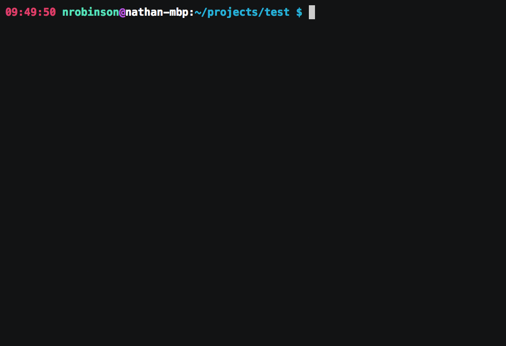
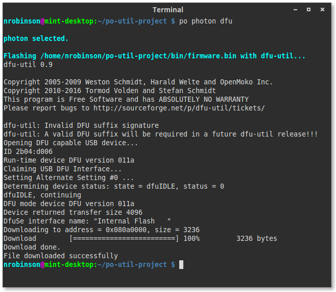
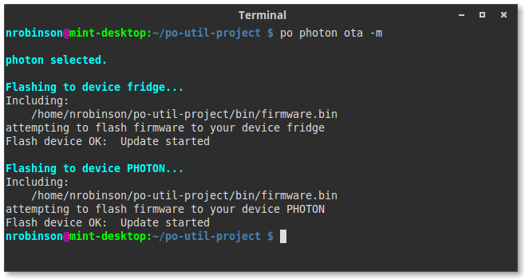


#po-util Docs


Particle Offline Utility, pronounced `po-util`, is a tool for installing and
using the Particle Toolchain on Linux and macOS.

`po-util` makes it easy for developers to download the Particle Toolchain and install the required dependencies to quickly begin creating projects using the Particle Platform.

`po-util` features a responsive experience, giving developers the tools they
need for seamless local development, providing understandable commands for
simplifying complex tasks like properly compiling and flashing firmware.


<br>






# Install

There are two versions of po-util. The first is [po-util Classic](https://github.com/nrobinson2000/po-util), which is designed for Linux distributions. The second is [po-util Homebrew Edition](https://github.com/nrobinson2000/homebrew-po), which is designed for macOS. Follow the [Installing po-util](install.md) section to install po-util on macOS or Linux.

Both versions of po-util have the same features. In December 2016, Homebrew Edition was forked from po-util in order to allow po-util to be installed with Homebrew.  The original po-util was renamed to Classic, and was made Linux exclusive. Both Classic and Homebrew Edition continue to be developed and maintained in parallel.






# Key Features



## Library Manager

The library manager makes it easy to use Particle libraries when developing
with po-util locally by using `git` to download Particle libraries hosted on
GitHub and save them to a ~/.po-util/lib directory so that they make be linked
inside of projects later. [Read more about the Library Manager here.](https://community.particle.io/t/how-to-use-po-utils-library-manager/26735)






## Full dependency setup

`po-util` installs all of the dependencies required for local Particle
Development, including the [ARM toolchain](https://launchpad.net/gcc-arm-embedded), [dfu-util](https://dfu-util.sourceforge.net/),
[nodejs](https://nodejs.org/en/), [particle-cli](https://github.com/spark/particle-cli) and the [Particle firmware](https://github.com/spark/firmware).

## Local compilation and support for flashing over USB or OTA

Building firmware locally for Electrons, Photons and P1s, and automatically
flashing over USB using dfu-util or Over The Air using particle-cli.
Sequentially flashing multiple devices at once over the air is also supported.



## Shortcuts for Building in Atom

`po-util` supports shortcuts for [Atom](https://atom.io), the popular open-
source IDE by GitHub. The shourcuts provide quick access to commonly used
commands for `po-util`, including: building firmware, flashing firmware over
USB, and flashing firmware Over The Air. [Read more about the shortcuts
here.](https://community.particle.io/t/po-util-a-toolchain-installer-helper-for-linux-and-osx/21015/29?u=nrobinson2000)








# Project Structure

The directory structure of a full `po-util` project is arranged like so:

* All user code is kept inside of `firmware/`.
* The compiled binary will be named `firmware.bin`, and it will be in `bin/`.
* You can keep track of which devices are in a project and list which ones to be flashed Over The Air in `devices.txt`.
* Libraries are kept track of in `libs.txt`.
* Atom shortcuts are configured in`.atom-build.yml`.
* Every `po-util` project is initialized as a repository with scripts in `ci/` to use [Travis CI](https://travis-ci.org/) for testing.



```
firmware/
├ main.cpp
└ lib1/
  ├ lib1.cpp
  ├ lib1.h
  └ ...
bin/
├ firmware.bin
└ ...
 ci/
 devices.txt
 libs.txt
 .atom-build.yml
 .travis.yml
 .gitignore
 .git/
 README.md
```





# Project setup

When using `po-util`, your code is arranged into projects with the structure
described above. This not only lets you easily work on many projects on one
computer, but it provides a standardized way of building locally.

Creating a project with `po-util` is simple when you use `po init` to initialize a project by creating the necessary files.

You can set `DEVICE_TYPE` to either `photon`, `P1`, `electron`, `core`, `pi`, or `duo`. This is
necessary for generating the Atom shortcuts file appropriately.


<br>
<br>
<br>
```bash
$ po init DEVICE_TYPE someProject
```





## Writing Firmware

`po-util` compiles any `.cpp` and `.h` files found in the `firmware/`
directory, but not `.ino` files, so `#include "Particle.h"` must be present
in your `main.cpp` file. This is done for you when you run the `po init`
command to create a project directory.

## Building Firmware

To compile firmware, simply run `po DEVICE_TYPE build`, substituting `DEVICE_TYPE` for
`photon`, `P1`, or `electron`. To compile and flash firmware to your device
using dfu-util, simply run `po DEVICE_TYPE flash`. To clean the project, run `po
DEVICE_TYPE clean`.








## DFU Commands

To upload precompiled code over USB, run `po DEVICE_TYPE dfu`. To put your device
into dfu mode, run `po dfu-open`. To get your device out of dfu mode, run `po
dfu-close`.










## Over The Air (OTA) Uploading

To upload precompiled code over the air using particle-cli, run `po DEVICE_TYPE ota
DEVICE_NAME`, where `DEVICE_NAME` is the name of your device in the Particle
cloud. You must be logged into particle-cli to use this feature. You can log
into particle-cli with `particle cloud login`.

You can also flash code to multiple devices at once by passing the `-m` or
`--multi` argument to `ota`. This would look like `po DEVICE_TYPE ota -m`. This
relies on a file called `devices.txt` that you must create in your `po-util`
project directory.

**This is different from the product firmware update feature in the Particle Console because it updates the firmware of devices one at a time and only if the devices are online when the command is run.**



<p align="center">

</p>





## Triggering DFU mode on your Device(s)

By default, `po-util` changes the trigger DFU Mode baud rate to `19200`, as it
is a more friendly baud rate for Linux Distributions. To make your device(s)
recognize this baud rate, you must run `po DEVICE_TYPE upgrade`. This will also
update the system firmware on your device(s).

If you wish to use the default Particle DFU Mode baud rate, you may change the
`DFUBAUDRATE=19200` line in the `~/.po` configuration file to
`DFUBAUDRATE=14400`.



```bash
$ po DEVICE upgrade # Upgrad device firmware to allow automatic DFU

$ po dfu-open # Automatically place a device in dfu mode

$ po dfu-list # Quickly find any devices in /dev/cu.*

$ po dfu-open -d /dev/cu.usbmodem1441 # Put a specific device into DFU mode

$ po dfu-close # Get device out of dfu mode
```


